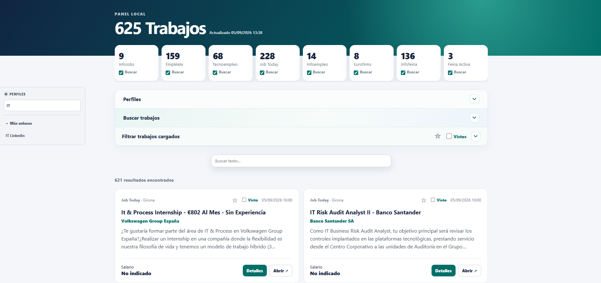

# Buscador Trabajos

> Proyecto construido con **OpenClaw + ChatGPT Codex**.

Panel local para buscar, revisar, guardar y filtrar ofertas públicas de empleo. 

Actualmente integra:
- [InfoJobs](https://www.infojobs.net/)
- [Empléate](https://www.empleate.gob.es/empleo/#/)
- [Tecnoempleo](https://www.tecnoempleo.com/)
- [Job Today](https://jobtoday.com/)
- [Infoempleo](https://www.infoempleo.com/)
- [Eurofirms](https://www.eurofirms.com/es/en/)
- [Infofeina](https://www.infofeina.com/)
- [Feina Activa](https://feinaactiva.gencat.cat/es/home)

Captura de la aplicación:


## Inicio rápido

### 1. Crear `docker-compose.yml`

Usa esta configuración:

```yaml

services:
  buscador_trabajos:
    image: ar0per0/buscador_trabajos:latest
    container_name: buscador_trabajos
    restart: unless-stopped
    init: true
    ports:
      - "8085:8081"
    volumes:
      - buscador_trabajos_data:/data

volumes:
  buscador_trabajos_data:
```

### 2. Levantar

Ejecuta:

```bash
docker compose up -d
```
Acceso:

```text
http://IP_DEL_EQUIPO:8085
```

---


## Funciones principales

- Búsqueda simple mediante una o varias combinaciones de puesto y ciudad.
- Búsqueda avanzada pegando URLs completas de resultados de las plataformas compatibles.
- Selección individual de plataformas y sincronización con el filtro «Fuente».
- Filtros por texto, palabras excluidas, fuente, modalidad, salario, fecha, vistos y favoritos.
- Detalles enriquecidos con párrafos, listas y negritas cuando la plataforma los proporciona.
- Navegación entre ofertas desde el detalle.
- Perfiles reutilizables que aplican su configuración e inician la búsqueda automáticamente.
- Favoritos persistentes, comprobación de enlaces y limpieza manual de favoritos rotos o antiguos.
- Trabajos vistos con caducidad automática a los seis meses.
- Enlaces de interés organizados por apartados, con importación y exportación.
- Diseño adaptable para escritorio, tableta y móvil.

## Requisitos

- Node.js 18 o posterior.
- npm.
- Chromium para Feina Activa y para los casos de Empléate que requieren navegador.

También puede ejecutarse con Docker, que ya incluye Chromium.

## Instalación y ejecución

```bash
npm ci
npm start
```

La aplicación escucha por defecto en `0.0.0.0:8085` y se abre en <http://localhost:8085>. El puerto puede cambiarse con `WEB_TRABAJOS_PORT`:

```bash
WEB_TRABAJOS_PORT=8090 npm start
```

## Uso

### Búsqueda simple

Introduce un puesto, una ciudad o ambos. Se pueden añadir varias filas de búsqueda. Los checks superiores determinan qué plataformas se consultan y, después de cargar resultados, también controlan las fuentes visibles.

### Búsqueda avanzada

Permite pegar URLs completas de páginas de resultados. Se conservan los filtros incluidos por la propia plataforma, como provincia, jornada, idioma o fecha de publicación.

Los resultados anteriores se ocultan inmediatamente al iniciar una búsqueda. El progreso se muestra con mensajes legibles y una barra de carga.

### Detalles

Los listados básicos no siempre contienen salario, jornada, estudios, experiencia o idiomas. Cuando es necesario, estos datos se obtienen al abrir la oferta. Por este motivo, los filtros aplicados a trabajos ya cargados pueden no ser completos hasta consultar sus detalles.

### Perfiles

Los perfiles guardan búsquedas, URLs avanzadas, plataformas y filtros. Los accesos del lateral aplican el perfil seleccionado e inician automáticamente su búsqueda. Los perfiles se pueden importar y exportar en JSON.

### Favoritos y vistos

Los favoritos conservan una copia de la oferta, su URL y la fecha `saved_at`. Desde la vista de favoritos se puede:

- Comprobar si los enlaces siguen disponibles.
- Eliminar, previa confirmación, enlaces que respondan definitivamente con `404` o `410`.
- Eliminar, previa confirmación, favoritos guardados hace más de seis meses.

Los errores temporales, bloqueos y tiempos de espera se muestran como «Sin confirmar» y no se consideran enlaces rotos. Los favoritos nunca se eliminan automáticamente.

Los trabajos vistos guardan la fecha `seen_at`. Las entradas con más de seis meses sí se eliminan automáticamente al iniciar el servidor y al actualizar cualquier estado de visto. El formato antiguo basado únicamente en `keys` se migra sin perder datos.

### Enlaces de interés

Permite crear apartados y guardar varias URLs dentro de cada uno. Los apartados y enlaces se pueden crear, modificar, eliminar, importar y exportar. Los enlaces guardados anteriormente al sistema de apartados se migran al grupo «General».

## Integraciones

| Plataforma | Listado | Detalle |
| --- | --- | --- |
| InfoJobs | HTML público con datos embebidos y paginación | Datos públicos del anuncio |
| Empléate | Resultados estructurados del portal público | Servicio público de la oferta |
| Tecnoempleo | HTML público paginado | HTML y datos `JobPosting` |
| Job Today | Listados SEO renderizados en servidor | Ficha pública de la oferta |
| Infoempleo | HTML público, excluyendo recomendaciones ajenas | HTML y datos `JobPosting` |
| Eurofirms | HTML público paginado | HTML y datos `JobPosting` |
| Infofeina | Buscador HTML público con paginación | Ficha HTML de la oferta |
| Feina Activa | Listado público con desplazamiento mediante Chromium | Ficha pública de la oferta |

Las ocho integraciones conservan la URL original del anuncio y normalizan sus datos al modelo común del panel. La descripción enriquecida se sanea antes de mostrarse.

## Ejecución manual de extractores

Cada integración puede actualizarse desde la terminal. Las búsquedas se pasan como una lista JSON:

```bash
INFOJOBS_SEARCHES='[{"keyword":"it","city":"Madrid"}]' npm run refresh:infojobs
EMPLEATE_SEARCHES='[{"keyword":"it","city":"Madrid"}]' npm run refresh:empleate
TECNOEMPLEO_SEARCHES='[{"keyword":"it","city":"Madrid"}]' npm run refresh:tecnoempleo
JOBTODAY_SEARCHES='[{"keyword":"it","city":"Madrid"}]' npm run refresh:jobtoday
INFOEMPLEO_SEARCHES='[{"keyword":"it","city":"Madrid"}]' npm run refresh:infoempleo
EUROFIRMS_SEARCHES='[{"keyword":"it","city":"Madrid"}]' npm run refresh:eurofirms
INFOFEINA_SEARCHES='[{"keyword":"it","city":"Madrid"}]' npm run refresh:infofeina
FEINAACTIVA_SEARCHES='[{"url":"https://feinaactiva.gencat.cat/es/search/offers/list?keywords=it"}]' npm run refresh:feinaactiva
```

`npm run refresh` es un alias de `npm run refresh:infojobs`.

InfoJobs consulta seis páginas cuando no se indica otra cantidad. Admite un número concreto o el catálogo completo:

```bash
INFOJOBS_PAGES=100 npm run refresh:infojobs
INFOJOBS_PAGES=all npm run refresh:infojobs
```

La descarga completa utiliza pausas, reintentos y checkpoints reanudables. La concurrencia predeterminada es 1 para reducir el riesgo de límites del servidor y puede ajustarse con `INFOJOBS_CONCURRENCY`.

Los extractores paginados admiten sus variables `*_MAX_PAGES` y `*_DELAY_MS`. Empléate admite `EMPLEATE_MAX_RESULTS`. Chromium puede indicarse mediante `CHROMIUM_PATH`.

## Persistencia

El directorio de datos predeterminado es la raíz del proyecto. Puede cambiarse mediante `DATA_DIR`; Docker utiliza `/data`.

| Archivo | Contenido |
| --- | --- |
| `jobs.json` | Resultados de la búsqueda más reciente |
| `favorite_jobs.json` | Favoritos, copia de cada oferta y metadatos de comprobación |
| `seen_jobs.json` | Claves vistas y fecha en que se marcaron |
| `search_profiles.json` | Perfiles de búsqueda guardados |

El formato básico de `jobs.json` es:

```json
{
  "scraped_at": null,
  "unique_records": 0,
  "jobs": []
}
```

Las escrituras de favoritos, vistos y perfiles se serializan y se realizan mediante reemplazo atómico para evitar archivos parcialmente escritos.

La selección de plataformas, el estado de los paneles y los enlaces de interés se guardan en el almacenamiento local del navegador. Las sugerencias de ciudad proceden del servicio público CartoCiudad del Instituto Geográfico Nacional.

## Docker

```bash
docker compose up -d --build
```

El panel queda disponible en <http://localhost:8085>. Los datos persistentes se guardan en el volumen `web_trabajos_data`. La imagen ejecuta la aplicación como usuario `node`, sin privilegios de administrador.

Para consultar el estado:

```bash
docker compose ps
docker compose logs -f web-trabajos
```

## Comprobación

```bash
npm run check
npm test
npm audit --omit=dev
docker compose config -q
```

`npm run check` valida la sintaxis de todos los archivos JavaScript. `npm test` ejecuta las pruebas de extractores, normalización, seguridad, persistencia y API.

## API

### Ofertas y estado

- `GET /api/jobs`
- `GET /api/jobs/favorites`
- `POST /api/jobs/seen`
- `POST /api/jobs/favorite`
- `POST /api/jobs/favorites/check`
- `POST /api/jobs/favorites/clean` con `{"mode":"broken"}` o `{"mode":"old"}`
- `GET /api/refresh-status`
- `POST /api/refresh/infojobs`
- `POST /api/search/jobs`
- `POST /api/search/infojobs` — alias compatible

### Detalles

- `GET /api/infojobs-detail?url=...`
- `GET /api/empleate-detail?id=...`
- `GET /api/tecnoempleo-detail?url=...`
- `GET /api/jobtoday-detail?url=...`
- `GET /api/infoempleo-detail?url=...`
- `GET /api/eurofirms-detail?url=...`
- `GET /api/infofeina-detail?url=...`
- `GET /api/feinaactiva-detail?url=...`

### Perfiles y ubicaciones

- `GET /api/search-profiles`
- `POST /api/search-profiles/save`
- `POST /api/search-profiles/delete`
- `GET /api/locations?q=...`

Las peticiones JSON tienen un límite de 128 KiB. Las URLs avanzadas y de detalle se validan contra los dominios compatibles antes de realizar solicitudes externas.
